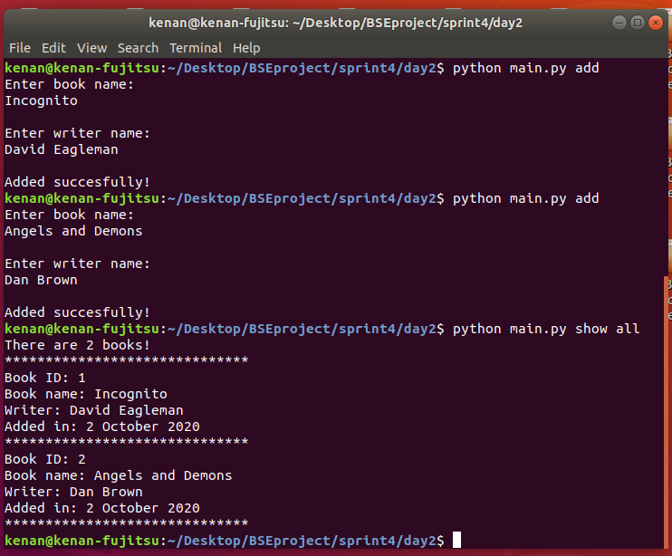
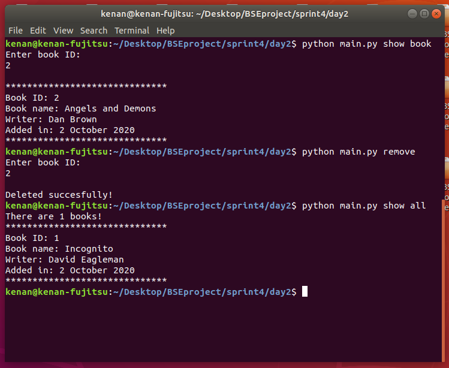
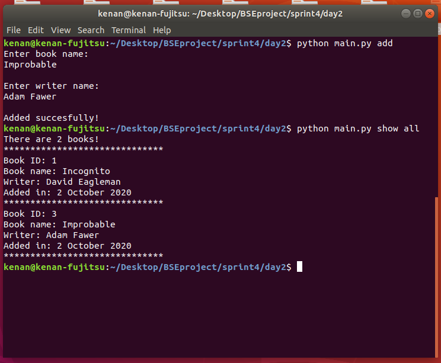

## Console App about Books

### 2.day tasks

* Write a console application that will write and read book information to a file.
* This application must have several functions. add_book(title, author), show_all(book_list), show_book(book_id), remove_book(book_id)
* When the application is running, a folder named books must be created if it does not exist.
* When the user enters the command add (python main.py add), The application should ask the user the name and author of the book.
* The application must also generate a unique id and date for the book.
* The book_list.txt file must be created into the books folder if it does not exist and the book information should be written to this file.
* When the user enters the command show all (python main.py show all), all books written to the book_list.txt file must be displayed.
* When the user enters the command show book (python main.py show book), The application should ask the book id and show that book.
* When the user enters the command remove (python main.py remove), The application should ask the book id and delete that book.
* Try deleting the book, whether the book is on the list or not. If an error occurs, let the user know that the book with this id does not exist.
* You must have a decorator named @no_book. You must use this decorator in the show_all(book_list) function.
* This decorator checks the length of the list included in the function and informs the user about it. If the list is empty, it notifies the user that there is no book and stops the application.
* If the command is not entered in the required format, the app should give the message 'Wrong input'.

### Console pictures

